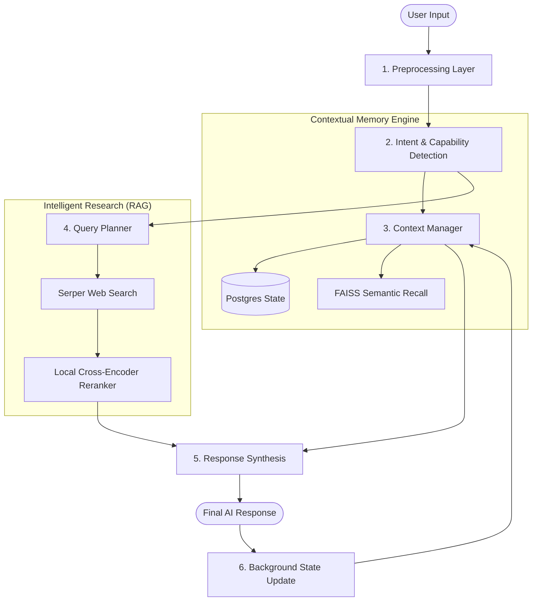
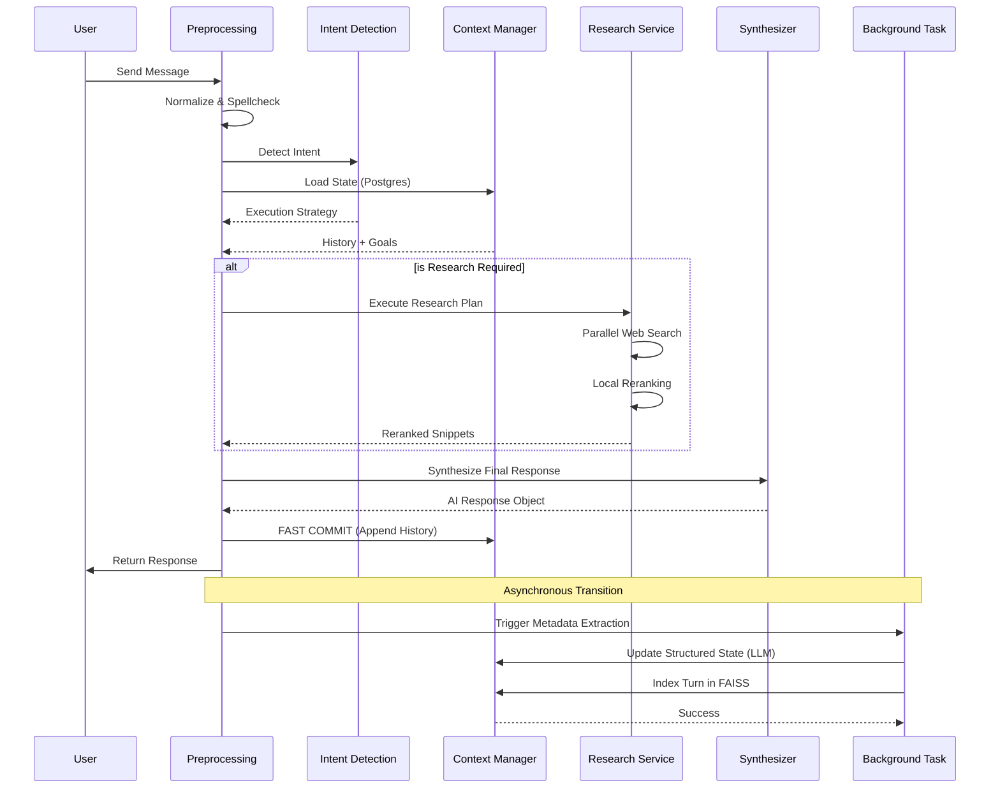

# EDITH: Advanced AI Architecture & Workflow Documentation

This document provides a deep-dive into the internal mechanics of the EDITH (Enhanced Digital Intelligence for Task Handling) system. It details how user inputs are transformed into intelligent, context-aware responses through a multi-stage, asynchronous pipeline.

---

## 1. High-Level Architecture

EDITH is built on a **Modular Micro-Orchestration** pattern. Instead of a single LLM call, the system decomposes every interaction into specialized stages to ensure factual accuracy, contextual continuity, and high performance.

### Detailed Sequence Workflow

---

## 2. Stage-by-Stage Breakdown

### Stage 1: Preprocessing Layer
**Tools:** `langdetect`, `pyspellchecker`, `unicodedata`
*   **Normalization**: Cleans Unicode noise and invisible characters.
*   **Language Detection**: Identifies the input language to tune the response style.
*   **Cleansing**: Performs local spelling correction using a frequency-based dictionary to ensure the LLM receives clean tokens.

### Stage 2: Intent & Capability Detection
**Tools:** `NVIDIA Llama-3.1-70B`, `IntentRegistry`
*   EDITH analyzes the query to determine the **Execution Strategy**.
*   **Direct Response**: For simple queries or greetings.
*   **Planner Required**: For complex tasks requiring sub-steps.
*   **Capabilities**: Detects if the query needs `web_search`, `file_system` access, or `image_generation`.

### Stage 3: Conversational Context & State Tracking
**Tools:** `SQLAlchemy (Postgres)`, `FAISS`, `SentenceTransformers`
*   **Structural Memory**: Loads the `ConversationState` (active topic, user goals, extracted entities).
*   **Semantic Recall**: Uses a vector search (FAISS) to retrieve relevant snippets from previous days or weeks of conversation.
*   **Resilience**: Automatically falls back to an in-memory dictionary if the database is unreachable.

### Stage 4: Research Pipeline (The RAG Flow)
**Tools:** `Serper API`, `ms-marco-MiniLM-L-6-v2 (Cross-Encoder)`
*   **Planning**: The LLM breaks a complex query (e.g., "Compare Python and Rust") into sequential research goals.
*   **Parallel Execution**: All search steps are executed concurrently via `asyncio.gather`.
*   **Local Reranking**: Search results are ranked locally using a **Cross-Encoder** to select only the top 5 most relevant snippets, eliminating noise and hallucination.

### Stage 5: Response Synthesis
**Tools:** `NVIDIA Llama-3.1-70B`
*   The system combines:
    1.  Cleaned User Input
    2.  Full Conversation History
    3.  Extracted State (Goals/Topics)
    4.  Reranked Research Findings
*   **The Result**: A factually grounded, cited, and contextually perfect response.

### Stage 6: Background Asynchronous Processing
**Tools:** `FastAPI BackgroundTasks`
*   To ensure the user doesn't wait, EDITH returns the response immediately after synthesis.
*   In the background, it performs **Metadata Extraction**: updating the topic, refining user goals, and indexing the current turn into the FAISS semantic memory.

---

## 3. Tool & Model Matrix

| Stage | Tool/Model | Host | Rationale |
| :--- | :--- | :--- | :--- |
| **Logic/Reasoning** | Llama-3.1-70B-Instruct | NVIDIA API | State-of-the-art reasoning and tool use. |
| **Embeddings** | all-MiniLM-L6-v2 | Local (CPU) | Fast, reliable vector generation. |
| **Reranking** | ms-marco-MiniLM-L-6-v2 | Local (CPU) | Precise relevance scoring without LLM cost. |
| **Search** | Serper.dev | External API | Real-time high-quality web indexing. |
| **Database** | PostgreSQL | Local/Cloud | ACID compliant structured state storage. |
| **Vector DB** | FAISS | In-Memory | Millisecond-latency semantic search. |

---

## 4. Inter-dependencies

1.  **Intent → Planner**: The Query Planner only triggers if the Intent Detector flags `planner_required`.
2.  **Context → Synthesis**: The Synthesizer depends on the Context Manager to provide the `active_topic`. If the topic changes, the Synthesizer adjusts its "persona" accordingly.
3.  **Research → Synthesis**: If research findings are present, the Synthesizer is strictly instructed to prioritize the findings over its internal training data (grounding).
4.  **Synthesis → Background Update**: The background update depends on the `assistant_message` produced by the Synthesizer to index the full "Turn" into long-term memory.

---

## 5. Performance Optimizations

*   **Startup Preloading**: Models are loaded into RAM at boot time.
*   **Parallelism**: Concurrency is used for DB loading + Intent detection + Research execution.
*   **Lazy Loading**: Non-critical libraries (like spellcheckers) are loaded only when first needed.
*   **Backgrounding**: Heavy extraction logic is moved out of the request-response loop.
